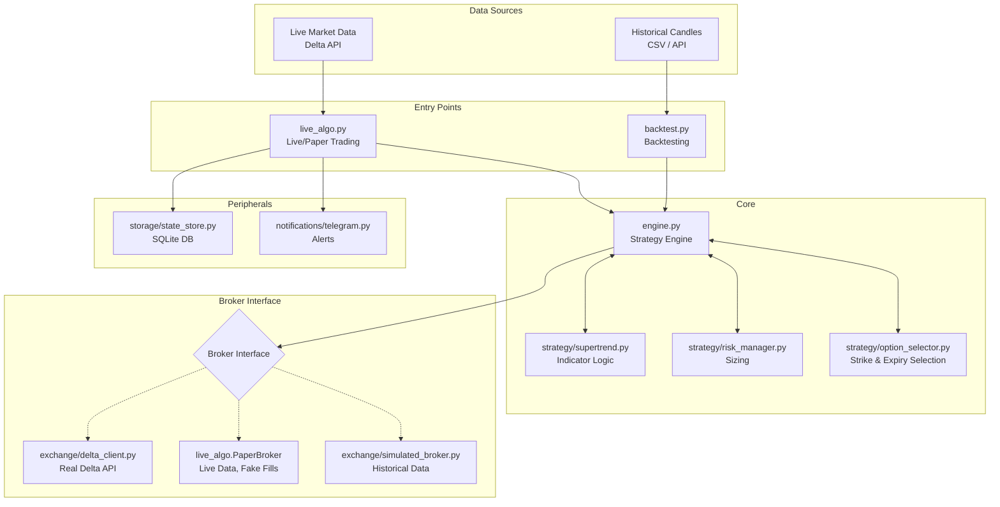

# Architecture Overview

> [!NOTE]
> This document provides a high-level overview of the Zero-DT Supertrend Options Selling strategy bot.

The `options_algo` repository is a Python-based automated trading system designed to sell options (Zero-Days-to-Expiration or 1DTE) on **Delta Exchange India**. It uses a **3-Hour Supertrend** indicator to determine market direction and automatically manages positions, risk, and state.

## Core Philosophy: Environment Agnostic Engine
The most critical architectural decision in this system is that **the core strategy engine (`engine.py`) has absolutely no knowledge of whether it is running in a live market, a paper-trading simulation, or a historical backtest**.

It only knows how to process closed candles, calculate Supertrend signals, and communicate with a generic `Broker` interface. The outer scripts (`live_algo.py` and `backtest.py`) are responsible for feeding data and providing the correct broker implementation. This guarantees that backtest logic and live logic never drift apart.

## System Architecture

## Directory Structure

| Directory/File | Purpose |
| --- | --- |
| `config.py` & `.env` | The single source of truth for all strategy parameters and API keys. |
| `engine.py` | The "brain". Tracks signals, enters/exits trades, manages stop-losses. |
| `broker.py` | Abstract interface defining what a Broker must do (quotes, orders, margins). |
| `live_algo.py` | The runner for real-time operation (Live or Paper). Polls candles and handles Telegram commands. |
| `backtest.py` | The runner for historical simulation. Replays candles and generates P&L reports. |
| `strategy/` | Contains the isolated logic for the Supertrend indicator, strike/expiry selection, and risk management. |
| `exchange/` | Contains the specific Broker implementations (`delta_client.py`, `simulated_broker.py`). |
| `storage/` | SQLite database wrapper to persist bot state across restarts. |
| `notifications/` | Telegram bot integration for trade alerts and `/logs` commands. |
| `run_diagnostic.py` | Utility to ping the real Delta Exchange API to fetch accurate contract specs and fee rates. |

> [!IMPORTANT]
> The system is designed to be highly resilient. The `live_algo.py` script reconciles its internal SQLite database with the actual open positions on Delta Exchange upon startup to ensure it never opens duplicate positions.
