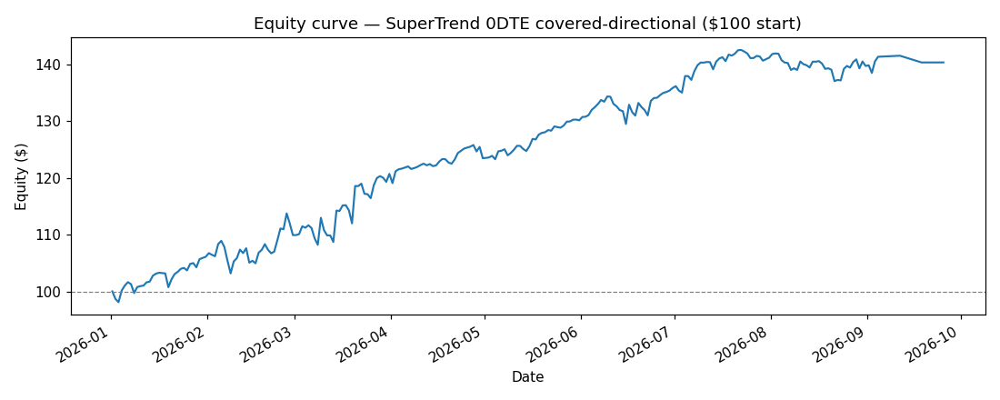

# SuperTrend 0DTE Covered-Directional — Simulation Results

## Strategy simulated

Exactly the live logic in `start_algo.py` + `src/expiry.py`, walked day by day over the 2026 tape from **$100** of starting capital.

- **Entry (when flat, 08:00 UTC):** SuperTrend (8h, ATR15, ×3.0) sets the bias. Bullish → LONG 1 future + SELL 1 ATM 0DTE **CALL**; bearish → SHORT 1 future + SELL 1 ATM 0DTE **PUT**. Stop-loss sits at the SuperTrend line (trails daily).
- **Intraday:** if price crosses the SuperTrend stop line the future is stopped out (the trend-flip exit). The 0DTE option still settles at 12:00 UTC.
- **0DTE expiry (12:00 UTC), future surviving:** bullish & spot > entry → CLOSE the future (take profit); else ROLL — keep the future and sell a new option struck at the future **entry price** (now OTM). Bearish is the mirror.
- **Sizing:** 1 contract/leg × 0.001 BTC. Fees 0.030% notional, option fee capped at 10% of premium.

## Results

**Period:** 2026-01-01 → 2026-09-25

| Metric | Value |
| --- | --- |
| Starting capital | $100.00 |
| **Ending equity** | **$140.36** |
| **Total return** | **+40.36%** |
| Total P&L | $+40.36 |
| Total trades | 359 (241 options, 118 futures) |
| Win rate | 281/359 (78.3%) |
| Premium (option) P&L | $+2.98 (win 78.4%) |
| Directional (future) P&L | $+37.38 (win 78.0%) |
| Future exits | 87 take-profit / 31 stop-loss |
| Total fees | $10.62 |
| Max drawdown | $5.72 (5.25%) |

## Equity curve

Full daily equity in [`simulation_equity.csv`](simulation_equity.csv); per-trade detail in [`simulation_trades.csv`](simulation_trades.csv).

### Monthly equity checkpoints

| Month-end | Equity |
| --- | --- |
| 2026-01 | $106.14 |
| 2026-02 | $109.96 |
| 2026-03 | $120.74 |
| 2026-04 | $123.49 |
| 2026-05 | $130.16 |
| 2026-06 | $135.86 |
| 2026-07 | $141.19 |
| 2026-08 | $139.73 |
| 2026-09 | $140.36 |
